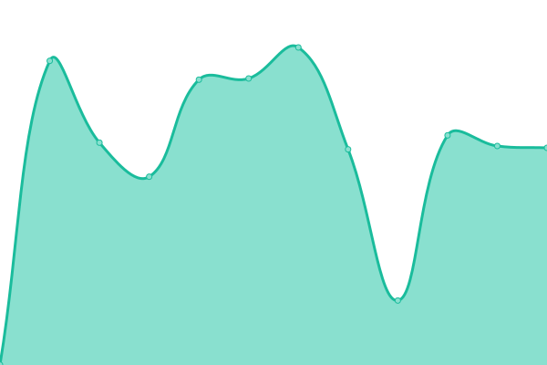

# [📈 Live Status](https://status.alternativasinteligentes.com): <!--live status--> **🟩 All systems operational**

This repository contains the open-source uptime monitor and status page for [aisa-status](https://status.alternativasinteligentes.com), powered by [Upptime](https://github.com/upptime/upptime).

With [Upptime](https://upptime.js.org), you can get your own unlimited and free uptime monitor and status page, powered entirely by a GitHub repository. We use [Issues](https://github.com/aisa-status/status-upptime/issues) as incident reports, [Actions](https://github.com/aisa-status/status-upptime/actions) as uptime monitors, and [Pages](https://status.alternativasinteligentes.com) for the status page.

<!--start: status pages-->
<!-- This summary is generated by Upptime (https://github.com/upptime/upptime) -->
<!-- Do not edit this manually, your changes will be overwritten -->
<!-- prettier-ignore -->
| URL | Status | History | Response Time | Uptime |
| --- | ------ | ------- | ------------- | ------ |
|  [Alternativas Inteligentes Site](alternativasinteligentes.com) | 🟩 Up | [alternativas-inteligentes-site.yml](https://github.com/aisa-status/status-upptime/commits/HEAD/history/alternativas-inteligentes-site.yml) | 

 696ms
     
 | 

<a href="https://status.alternativasinteligentes.com/history/alternativas-inteligentes-site">100.00%</a>
    

|  [Panel Chatroom](https://chatroom.alternativasinteligentes.com/) | 🟩 Up | [panel-chatroom.yml](https://github.com/aisa-status/status-upptime/commits/HEAD/history/panel-chatroom.yml) | 

 117ms
     
 | 

<a href="https://status.alternativasinteligentes.com/history/panel-chatroom">100.00%</a>
    

|  [Turnos 24x7](https://reservas.alternativasinteligentes.com/) | 🟩 Up | [turnos-24x7.yml](https://github.com/aisa-status/status-upptime/commits/HEAD/history/turnos-24x7.yml) | 

 223ms
     
 | 

<a href="https://status.alternativasinteligentes.com/history/turnos-24x7">100.00%</a>
    

<!--end: status pages-->

[**Visit our status website →**](https://status.alternativasinteligentes.com)

## 📄 License

- Powered by: [Upptime](https://github.com/upptime/upptime)
- Code: [MIT](./LICENSE) © [aisa-status](https://status.alternativasinteligentes.com)
- Data in the `./history` directory: [Open Database License](https://opendatacommons.org/licenses/odbl/1-0/)
